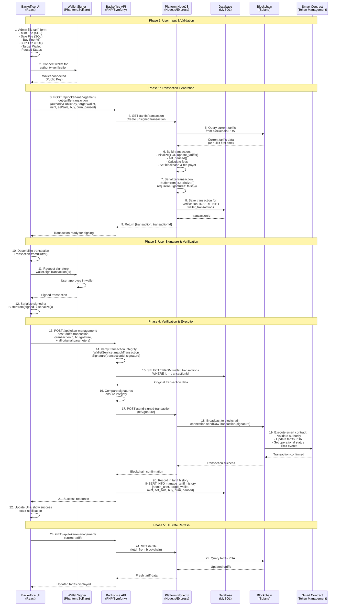

# Tariff Management Technical Workflow

## Overview

The Sevens Backoffice implements a sophisticated multi-layer tariff management system that securely updates blockchain-based fee structures through a comprehensive validation and verification process.

## Visual Architecture

### System Architecture Overview

```
┌─────────────────────────────────────────────────────────────────┐
│                    TARIFF MANAGEMENT ARCHITECTURE               │
└─────────────────────────────────────────────────────────────────┘

┌─────────────────┐    ┌─────────────────┐    ┌─────────────────┐
│   FRONTEND      │    │    BACKEND      │    │   BLOCKCHAIN    │
│                 │    │                 │    │                 │
│ ┌─────────────┐ │    │ ┌─────────────┐ │    │ ┌─────────────┐ │
│ │ React UI    │ │    │ │ PHP/Symfony │ │    │ │ Node.js     │ │
│ │ TariffForm  │◄├────┤►│ API Layer   │◄├────┤►│ Service     │ │
│ └─────────────┘ │    │ └─────────────┘ │    │ └─────────────┘ │
│                 │    │                 │    │                 │
│ ┌─────────────┐ │    │ ┌─────────────┐ │    │ ┌─────────────┐ │
│ │ Wallet      │ │    │ │ MySQL       │ │    │ │ Solana      │ │
│ │ Connector   │ │    │ │ Database    │ │    │ │ Blockchain  │ │
│ └─────────────┘ │    │ └─────────────┘ │    │ └─────────────┘ │
└─────────────────┘    └─────────────────┘    └─────────────────┘
        │                        │                        │
        │                        │                        │
        └────────── HTTPS ───────┼──── Internal API ──────┘
                                 │
                          ┌──────────────┐
                          │   SMART      │
                          │  CONTRACT    │
                          │ (Rust/Anchor)│
                          └──────────────┘
```

### Workflow Process Flow

```
Phase 1: INPUT          Phase 2: GENERATION     Phase 3: SIGNATURE     Phase 4: EXECUTION
┌─────────────┐        ┌─────────────────┐     ┌─────────────────┐     ┌─────────────────┐
│   ADMIN     │        │    BACKEND      │     │     WALLET      │     │   BLOCKCHAIN    │
│             │        │                 │     │                 │     │                 │
│ 1. Fill     │   2.   │ 3. Create       │  4. │ 5. User Signs   │ 6.  │ 7. Verify &     │
│    Form  ───┼────────┤    Transaction ─┼─────┤    Transaction ─┼─────┤    Execute      │
│             │        │                 │     │                 │     │                 │
│ • Mint Fee  │        │ • Query State   │     │ • Phantom       │     │ • Authority     │
│ • Sale Fee  │        │ • Build TX      │     │ • Solflare      │     │   Check         │
│ • Buy Fee   │        │ • Store in DB   │     │ • Approve       │     │ • Update PDA    │
│ • Target $  │        │ • Return TX ID  │     │ • Sign          │     │ • Log History   │
└─────────────┘        └─────────────────┘     └─────────────────┘     └─────────────────┘
```

### Security Verification Chain

```
┌─────────────────────────────────────────────────────────────────────────┐
│                          SECURITY LAYERS                                │
├─────────────────────────────────────────────────────────────────────────┤
│                                                                         │
│  ┌─────────┐    ┌─────────┐    ┌─────────┐    ┌─────────┐               │
│  │   UI    │    │   API   │    │ NodeJS  │    │  Smart  │               │
│  │ Layer   │    │ Layer   │    │ Layer   │    │Contract │               │
│  └────┬────┘    └────┬────┘    └────┬────┘    └────┬────┘               │
│       │              │              │              │                    │
│  ✓ Wallet       ✓ JWT Auth     ✓ TX Store    ✓ Authority                │
│    Connect        Admin Role     & Verify      Validation               │
│                                                                         │
│  ✓ Form          ✓ Signature    ✓ Blockchain  ✓ On-chain                │
│    Validation      Matching       Interface     State Update            │
│                                                                         │
└─────────────────────────────────────────────────────────────────────────┘
```


## Complete Technical Flow



## Architecture Components

### 1. **Frontend Layer (React/Redux)**
```javascript
// TariffForm.js - Main workflow orchestrator
const handleSubmit = async (e) => {
  // Phase 2: Get transaction from backend
  const transactionData = await tokenManagementApi.getTariffTransaction({
    authorityPublicKey: wallet.publicKey.toString(),
    targetWallet: formData.targetWallet,
    mint, setSale, buy, burn, paused
  });

  // Phase 3: Sign with wallet
  const txSignature = await wallet.signTransaction(
    Transaction.from(deserializeTransaction(transactionData.transaction))
  );

  // Phase 4: Submit signed transaction
  await tokenManagementApi.postTariffTransaction({
    transactionId: transactionData.transactionId,
    txSignature: serializeTransaction(txSignature),
    // ... parameters for verification
  });
};
```

### 2. **Backend API Layer (PHP/Symfony)**
```php
// TokenManagementTariffsService.php
public function getTariffsTransaction(
    string $authorityPublicKey,
    string $targetWallet,
    float $mint, float $setSale, int $buy, float $burn, bool $paused
): array {
    $transaction = $this->nodeApi->getTariffTransaction(/*...*/);

    return [
        'transactionId' => $this->walletService->saveTransaction($transaction),
        'transaction' => $transaction,
    ];
}

public function postTransaction(/*...*/, string $transactionId, string $txSignature): void {
    // Critical security verification
    $this->walletService->matchTransactionSignature($transactionId, $txSignature);

    // Send to blockchain
    $this->nodeApi->sendSignedTransaction($txSignature);

    // Record in database
    $tariffHistory = new ManageTariffHistory();
    // ... set properties and persist
}
```

### 3. **NodeJS Service Layer**
```javascript
// tariffsService.js - Blockchain interface
async getSetTariffsTransaction(
    authorityPublicKey, targetWallet, mintSol, setSaleSol, buy, burnSol, paused
) {
    const authority = new PublicKey(authorityPublicKey);
    const tariffsPda = this.getTariffsPda();

    const tx = new Transaction();

    // Check if first time initialization needed
    const accountExists = await this.connection.getAccountInfo(tariffsPda);

    if (!accountExists) {
        // initialize() instruction
        const initIx = await this.program.methods.initialize(/*...*/).instruction();
        tx.add(initIx);
    } else {
        // update_tariffs() instruction
        const updateIx = await this.program.methods.updateTariffs(/*...*/).instruction();
        tx.add(updateIx);
    }

    // set_paused() instruction
    const setPausedIx = await this.program.methods.setPaused(paused).instruction();
    tx.add(setPausedIx);

    tx.feePayer = authority;
    tx.recentBlockhash = (await this.connection.getLatestBlockhash()).blockhash;

    return serializeTransaction(tx);
}
```

### 4. **Smart Contract Layer (Rust/Anchor)**
```rust
// Token Management Contract
#[program]
pub mod sevens_token_management {
    pub fn update_tariffs(
        ctx: Context<UpdateTariffs>,
        target_wallet: Pubkey,
        mint: u64,
        set_sale: u64,
        buy: u8,
        burn: u64,
    ) -> Result<()> {
        let tariffs = &mut ctx.accounts.tariffs;

        // Validate authority
        require!(
            ctx.accounts.authority.key() == tariffs.authority,
            ErrorCode::UnauthorizedAccess
        );

        // Update tariff values
        tariffs.target_wallet = target_wallet;
        tariffs.mint = mint;
        tariffs.set_sale = set_sale;
        tariffs.buy = buy;
        tariffs.burn = burn;

        Ok(())
    }

    pub fn set_paused(ctx: Context<SetPaused>, paused: bool) -> Result<()> {
        let tariffs = &mut ctx.accounts.tariffs;
        tariffs.paused = paused;
        Ok(())
    }
}
```

## Security Features

### 1. **Transaction Integrity Verification**
- **Database Verification**: Original transaction stored and compared
- **Signature Matching**: Exact signature comparison prevents tampering
- **Authority Validation**: Smart contract validates signer authority
- **Parameter Consistency**: All parameters re-verified on submission

### 2. **Multi-Layer Access Control**
- **UI Level**: Wallet connection required
- **API Level**: JWT admin authentication required
- **Blockchain Level**: Authority signature validation
- **Smart Contract Level**: On-chain authority verification

### 3. **State Consistency**
- **Database Logging**: Complete audit trail in `manage_tariff_history`
- **Blockchain State**: Immutable record in tariffs PDA
- **UI Synchronization**: Real-time state refresh after updates
- **Error Handling**: Rollback on any failure point

## Database Schema

### Tariff History Tracking
```sql
CREATE TABLE manage_tariff_history (
    id BIGINT PRIMARY KEY AUTO_INCREMENT,
    admin_user_id BIGINT NOT NULL,
    target_wallet VARCHAR(44) NOT NULL,
    mint DECIMAL(15,9) NOT NULL,
    set_sale DECIMAL(15,9) NOT NULL,
    buy TINYINT UNSIGNED NOT NULL,
    burn DECIMAL(15,9) NOT NULL,
    paused BOOLEAN NOT NULL DEFAULT FALSE,
    created_at TIMESTAMP DEFAULT CURRENT_TIMESTAMP,

    FOREIGN KEY (admin_user_id) REFERENCES users(id)
);
```

### Transaction Verification Storage
```sql
CREATE TABLE wallet_transactions (
    id VARCHAR(36) PRIMARY KEY,
    transaction_data LONGTEXT NOT NULL,
    signature VARCHAR(128) NULL,
    created_at TIMESTAMP DEFAULT CURRENT_TIMESTAMP,
    expires_at TIMESTAMP NOT NULL
);
```

## Error Handling & Edge Cases

### Frontend Validation
- **Wallet Connection**: Verify wallet is connected before proceeding
- **Input Validation**: Client-side validation for immediate feedback
- **Network Errors**: Graceful handling of API timeouts
- **Transaction Failures**: User-friendly error messages

### Backend Validation
- **Parameter Validation**: Server-side validation of all inputs
- **Authority Verification**: Ensure signer has admin privileges
- **Transaction Expiry**: Time-limited transaction validity
- **Duplicate Prevention**: Prevent double-submission

### Blockchain Integration
- **Network Issues**: Retry logic for blockchain communication
- **Insufficient Funds**: Clear error messages for fee payment
- **Program Errors**: Smart contract error handling and reporting
- **State Conflicts**: Handle concurrent modification attempts

## Performance Considerations

### Optimization Strategies
- **Transaction Caching**: Store prepared transactions temporarily
- **Batch Operations**: Group multiple fee updates when possible
- **Connection Pooling**: Efficient blockchain connection management
- **Database Indexing**: Optimized queries for tariff history

### Scalability Features
- **Async Processing**: Non-blocking transaction handling
- **Error Recovery**: Automatic retry mechanisms
- **Load Balancing**: Distributed API processing
- **Monitoring**: Comprehensive logging and metrics

---

This technical workflow demonstrates the sophisticated integration between traditional web technologies and blockchain infrastructure, providing both security and usability for administrative operations.