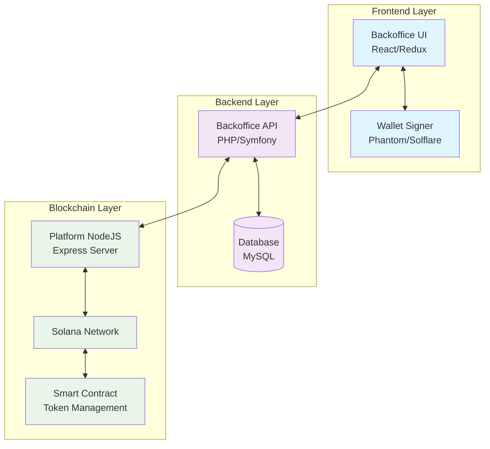
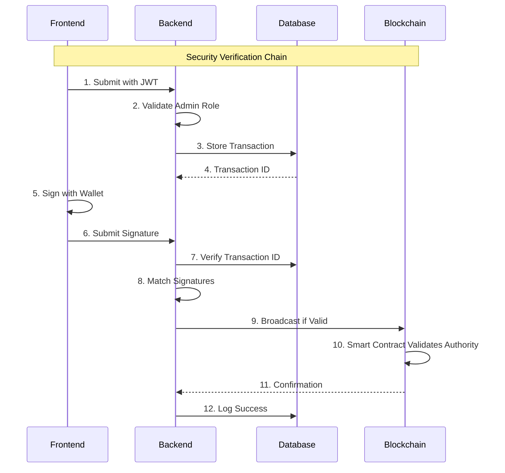
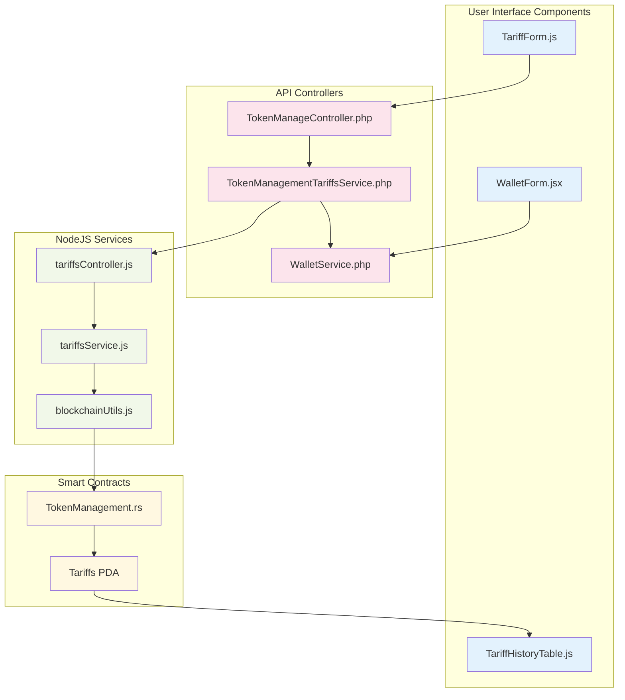

# Tariff Management Visual Architecture

## System Architecture Overview

```mermaid
graph TB
    subgraph "Frontend Layer"
        UI[Backoffice UI<br/>React/Redux]
        Wallet[Wallet Signer<br/>Phantom/Solflare]
    end

    subgraph "Backend Layer"
        API[Backoffice API<br/>PHP/Symfony]
        DB[(Database<br/>MySQL)]
    end

    subgraph "Blockchain Layer"
        NodeJS[Platform NodeJS<br/>Express Server]
        BC[Solana Network]
        SC[Smart Contract<br/>Token Management]
    end

    UI <--> Wallet
    UI <--> API
    API <--> DB
    API <--> NodeJS
    NodeJS <--> BC
    BC <--> SC

    classDef frontend fill:#e1f5fe
    classDef backend fill:#f3e5f5
    classDef blockchain fill:#e8f5e8

    class UI,Wallet frontend
    class API,DB backend
    class NodeJS,BC,SC blockchain
```

## Data Flow Process

```mermaid
flowchart LR
    A[Admin Input] --> B[Form Validation]
    B --> C[Wallet Connect]
    C --> D[Get Transaction]
    D --> E[Sign Transaction]
    E --> F[Verify & Submit]
    F --> G[Blockchain Update]
    G --> H[Audit Log]
    H --> I[UI Refresh]

    classDef process fill:#fff3e0
    classDef security fill:#ffebee
    classDef blockchain fill:#e8f5e8

    class A,B,I process
    class C,E,F security
    class D,G blockchain
```

## Security Verification Chain

```mermaid
sequenceDiagram
    participant UI as Frontend
    participant API as Backend
    participant DB as Database
    participant BC as Blockchain

    Note over UI,BC: Security Verification Chain

    UI->>API: 1. Submit with JWT
    API->>API: 2. Validate Admin Role
    API->>DB: 3. Store Transaction
    DB-->>API: 4. Transaction ID

    UI->>UI: 5. Sign with Wallet
    UI->>API: 6. Submit Signature

    API->>DB: 7. Verify Transaction ID
    API->>API: 8. Match Signatures
    API->>BC: 9. Broadcast if Valid

    BC->>BC: 10. Smart Contract Validates Authority
    BC-->>API: 11. Confirmation
    API->>DB: 12. Log Success
```

## Component Integration Map

```mermaid
graph TD
    subgraph "User Interface Components"
        TF[TariffForm.js]
        WF[WalletForm.jsx]
        TH[TariffHistoryTable.js]
    end

    subgraph "API Controllers"
        TC[TokenManageController.php]
        TS[TokenManagementTariffsService.php]
        WS[WalletService.php]
    end

    subgraph "NodeJS Services"
        TAR[tariffsController.js]
        TARS[tariffsService.js]
        BC[blockchainUtils.js]
    end

    subgraph "Smart Contracts"
        TMC[TokenManagement.rs]
        PDA[Tariffs PDA]
    end

    TF --> TC
    WF --> WS
    TC --> TS
    TS --> WS
    TS --> TAR
    TAR --> TARS
    TARS --> BC
    BC --> TMC
    TMC --> PDA
    PDA --> TH

    classDef ui fill:#e3f2fd
    classDef api fill:#fce4ec
    classDef node fill:#f1f8e9
    classDef contract fill:#fff8e1

    class TF,WF,TH ui
    class TC,TS,WS api
    class TAR,TARS,BC node
    class TMC,PDA contract
```